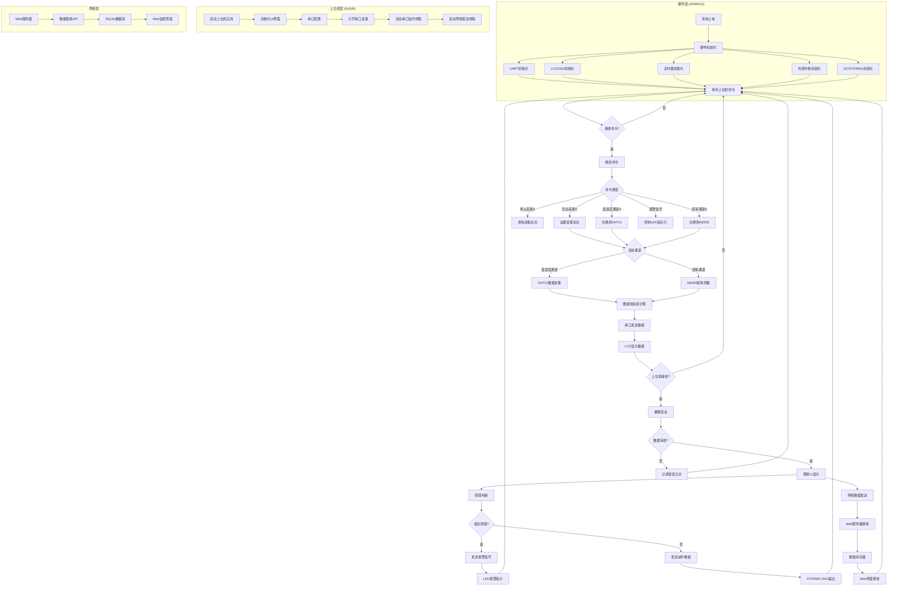
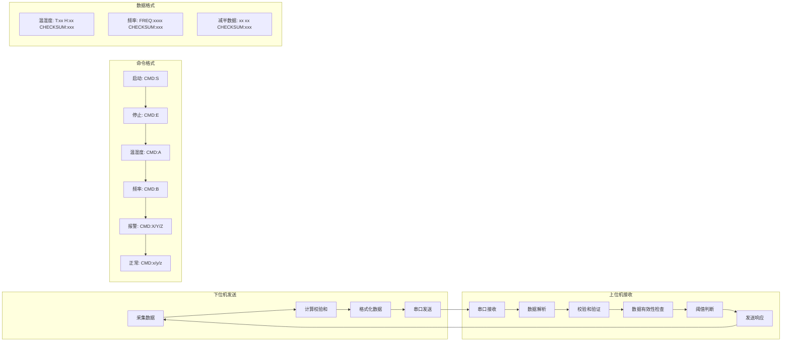
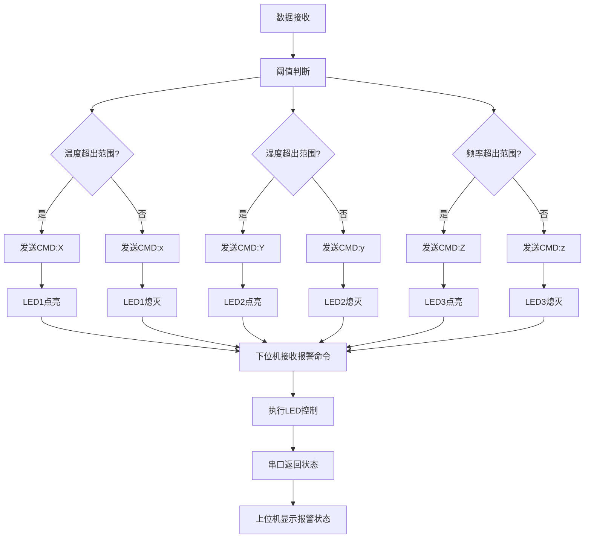
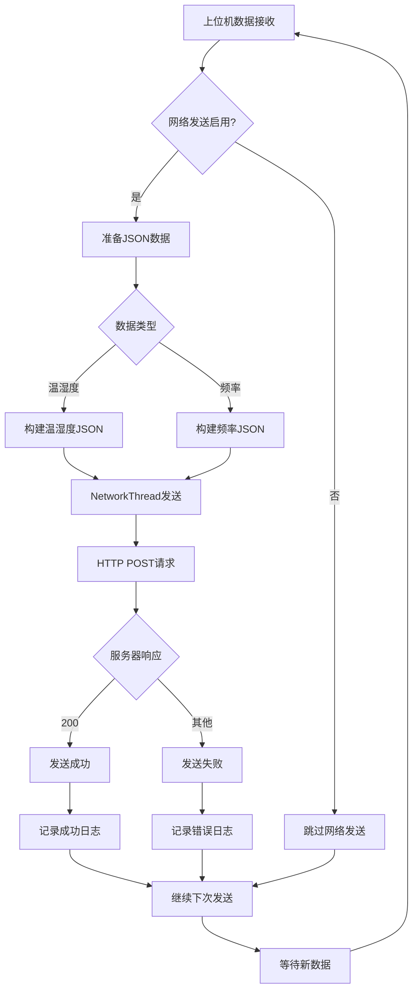
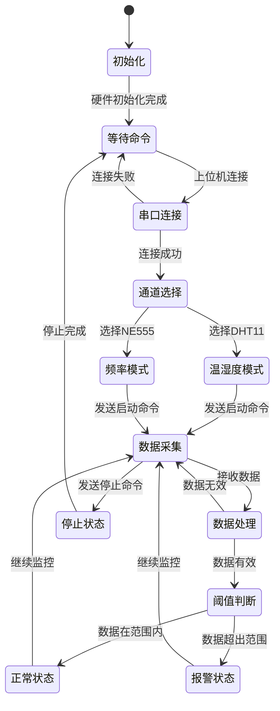
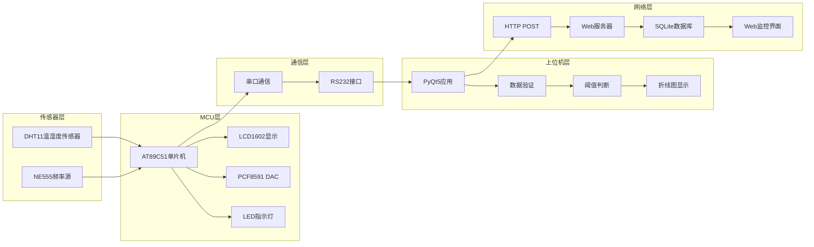

# 温湿度/频率监控系统流程图

## 系统总体架构流程图



## 硬件初始化流程图

```mermaid
graph TD
    A[AT89C51上电] --> B[系统复位]
    B --> C[初始化变量]
    C --> D[UART_Init]
    D --> E[LCD_Init]
    E --> F[Timer0_Init]
    F --> G[INT0_Init]
    G --> H[EA = 1 总中断使能]
    H --> I[LCD显示"WAIT CMD"]
    I --> J[进入主循环]
    
    subgraph "UART初始化"
        D1[SCON = 0x50] --> D2[TMOD |= 0x20]
        D2 --> D3[TH1 = 0xFD]
        D3 --> D4[TL1 = 0xFD]
        D4 --> D5[TR1 = 1]
        D5 --> D6[ES = 1]
    end
    
    subgraph "LCD初始化"
        E1[LCD_WriteCmd 0x38] --> E2[LCD_WriteCmd 0x0C]
        E2 --> E3[LCD_WriteCmd 0x06]
        E3 --> E4[LCD_WriteCmd 0x01]
    end
    
    subgraph "定时器初始化"
        F1[TMOD &= 0xF0] --> F2[TMOD |= 0x01]
        F2 --> F3[TH0 = 65536-50000/256]
        F3 --> F4[TL0 = 65536-50000%256]
        F4 --> F5[ET0 = 1]
        F5 --> F6[TR0 = 1]
    end
    
    subgraph "外部中断初始化"
        G1[IT0 = 1] --> G2[下降沿触发]
    end
```

## 数据采集流程图

```mermaid
graph TD
    A[主循环开始] --> B{采集标志?}
    B -->|否| C[显示"WAIT CMD"]
    B -->|是| D{当前通道}
    
    D -->|温湿度| E[DHT11采集流程]
    D -->|频率| F[NE555频率测量]
    
    subgraph "DHT11采集流程"
        E1[DHT11_Start] --> E2[发送起始信号]
        E2 --> E3[Read_Data_From_DHT]
        E3 --> E4[读取5字节数据]
        E4 --> E5{校验和正确?}
        E5 -->|是| E6[提取温湿度值]
        E5 -->|否| E7[返回错误]
        E6 --> E8[LCD显示数据]
        E8 --> E9[串口发送数据]
    end
    
    subgraph "NE555频率测量"
        F1[使能外部中断EX0=1] --> F2[Timer0定时1秒]
        F2 --> F3[INT0_ISR计数脉冲]
        F3 --> F4[1秒后读取计数值]
        F4 --> F5[计数值即为频率]
        F5 --> F6[LCD显示频率]
        F6 --> F7[串口发送数据]
    end
    
    E --> G[数据校验和计算]
    F --> G
    G --> H[串口发送]
    H --> I[LCD显示]
    I --> J[等待下次采集]
    J --> A
```

## 上位机处理流程图

```mermaid
graph TD
    A[启动PyQt5应用] --> B[初始化MainWindow]
    B --> C[创建UI组件]
    C --> D[设置串口配置]
    D --> E[用户点击"打开串口"]
    E --> F[创建SerialThread]
    F --> G[启动串口监听]
    G --> H[用户点击"启动采集"]
    H --> I[发送CMD:S命令]
    I --> J[启动NetworkThread]
    J --> K[开始数据接收循环]
    
    K --> L{接收到数据?}
    L -->|是| M[数据验证]
    L -->|否| K
    
    M --> N{数据格式正确?}
    N -->|是| O[解析数据]
    N -->|否| P[记录错误日志]
    
    O --> Q{当前通道}
    Q -->|温湿度| R[解析T和H值]
    Q -->|频率| S[解析FREQ值]
    
    R --> T[更新温湿度显示]
    S --> U[更新频率显示]
    
    T --> V[阈值判断]
    U --> V
    
    V --> W{超出阈值?}
    W -->|是| X[发送报警信号]
    W -->|否| Y[发送减半数据]
    
    X --> Z[LED报警指示]
    Y --> AA[PCF8591 DAC输出]
    
    T --> BB[更新折线图]
    U --> BB
    BB --> CC[网络数据发送]
    CC --> DD[Web服务器]
    
    P --> K
    Z --> K
    AA --> K
    DD --> K
```

## 通信协议流程图



## 报警处理流程图



## 网络传输流程图



## 用户操作流程图

```mermaid
graph TD
    A[用户启动系统] --> B[选择串口]
    B --> C[点击"打开串口"]
    C --> D{串口打开成功?}
    D -->|是| E[选择采集通道]
    D -->|否| F[显示错误信息]
    
    E --> G[设置阈值范围]
    G --> H[点击"启动采集"]
    H --> I[发送启动命令]
    I --> J{下位机响应?}
    J -->|是| K[开始数据采集]
    J -->|否| L[检查连接状态]
    
    K --> M[实时数据显示]
    M --> N[折线图更新]
    N --> O[阈值监控]
    O --> P{数据超出阈值?}
    P -->|是| Q[报警指示]
    P -->|否| R[正常显示]
    
    Q --> S[LED指示灯]
    R --> T[减半数据输出]
    
    S --> U[用户观察状态]
    T --> U
    U --> V{继续监控?}
    V -->|是| M
    V -->|否| W[点击"停止采集"]
    
    W --> X[发送停止命令]
    X --> Y[停止数据采集]
    Y --> Z[关闭串口]
    Z --> AA[系统结束]
    
    F --> BB[重新配置]
    L --> BB
    BB --> B
```

## 系统状态转换图



## 数据流向图



这个流程图完整地展示了整个温湿度/频率监控系统的工作流程，包括：

1. **系统初始化流程** - 硬件和软件的启动过程
2. **数据采集流程** - DHT11和NE555的数据获取过程
3. **上位机处理流程** - PyQt5应用的数据处理逻辑
4. **通信协议流程** - 上下位机之间的数据交换格式
5. **报警处理流程** - 阈值判断和报警机制
6. **网络传输流程** - 数据上传到Web服务器的过程
7. **用户操作流程** - 用户与系统的交互过程
8. **系统状态转换** - 各个工作状态之间的转换关系
9. **数据流向图** - 数据在系统中的流动路径

每个流程图都详细展示了系统的不同方面，帮助理解整个系统的工作原理和数据流向。 